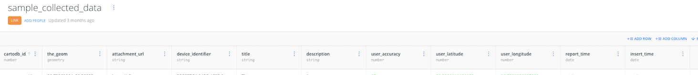

# DATA COLLECTION

Sample app demonstrating how **Carto Mobile SDK** and **CARTO Engine** can be used to collect location-based data. It covers most common use case for point + image data collection:

1. User selects location on map - using assistance from GPS
2. Enters data form
3. Adds optional camera photo
4. Posts the data to the database.

* The database is a table in **CARTO Engine** account
* Map layout for your objects on map (colors, styles) is defined in **CARTO Builder**
* Photos are stored to a S3 bucket

## SETUP

### 1. Prepare your CARTO account

1. You need CARTO.com account. Technically any account plan, including free trial should work
2. Create table called `sample_collected_data` in your CARTO. The table must have following fields, with same names:
`device_identifier,title,description,user_accuracy,user_latitude,user_longitude,report_time,attachment_url,insert_time`

Like here sample (note that `the_geom` and `cartodb_id` fields are created automatically):

3. Create an SQL function in your CARTO database. You can do it with using SQL query window in Builder Dataset viewer, with following source [cdb_insert_collected_data.sql](cdb_insert_collected_data.sql)). If you use same default table name and fields as in table definition, then no need to change this.

4. Create **Map** for your table. You may want to add some data points to the table to see how it looks like. You can change the color of your entries, how they are aggregated etc. 

* Selected base map in mobile is always Voyager vector map (same as default in web), different one selected in web is ignored. You can change mobile basemap in code of the mobile app.
* The map has to be *Shared with link* (or public) permission
* Note down the GUID of the map - it is long (64bit) encoded number in the URL of map, after /builder/ part.

### 2. Prepare your Amazon S3 bucket for photos

1. You need also AWS account and S3 bucket to store the photos
2. Add bucket and create special limited key for this via AIM tool. The bucket images have to be publicly readable, and keys should have permission to add objects to the bucket. Note down your bucket name and access keys

### 3. Configure mobile app

1. Clone this repository, open the Xamarin project (data.collection.sln) in Visual Studio, wait for the packages to restore
2. Rename `Conf_Template.cs` in the *data.collection/Conf* folder to `Conf.cs` 
3. Change as minimum following: 

* **Username** - your CARTO username
* **MapName** - your map name, it is like GUID in URL of your map, but the formatting is a bit different: add `tpl_` as prefix and replace dashes with underscores, so with our map, original `76370647-9649-4d19-a6d5-4144348a6f67` becomes to : `tpl_76370647_9649_4d19_a6d5_4144348a6f67`
* **S3BucketName**, **S3AccessKey** and **S3SecretKey** - your S3 bucket and keys

### 4. Customize and use the app

If basic sample is working, then you probably want to create your own modified data form, use own fields etc. Gradually adjust mobile side (UI and data objects) and backend side (dataset in CARTO and the SQL function parameters) in parallel, make sure backend accepts new fields etc. You can also add your specific rules to checking data etc.

## USAGE

1. Start app
2. Go to location where you want to add data. It will automatically jump to GPS location
3. Press the **+** icon to open location choice mode (target is shown in map center), and click done when complete. 
4. A data form is opened. Now enter a **title**, **description** and, optionally, **take a photo** – now press the done button

If device is online, then your data will be immediately uploaded to our CARTO table and, if taken, your photo will be uploaded to amazon S3 (the url is added to your CARTO table).

If data upload fails, then app keeps data in local cache (a SQLite database) offline, and retries upload again with next application statup. *In your production app you may need more complex logic for this.*

# PROJECT STRUCTURE

The Xamarin .NET app uses platform-specific native views, it does not use Xamarin Forms to get better user experience. All of the custom views (buttons, crosshair, banner etc.) are native code (UIView/RelativeLayout).

CARTO's Mobile SDK MapView for iOS and Droid API is common, so most of the logic related to the SDK is situated in the shared project.

Networking, parsing and local storage logic is also in the shared project, for maximum code reuse.

## DISCLAIMER!

This is a sample app with relatively simple code structure, it has not passed extensive testing etc. Review it, modify it and you can also post Pull Requests to us.