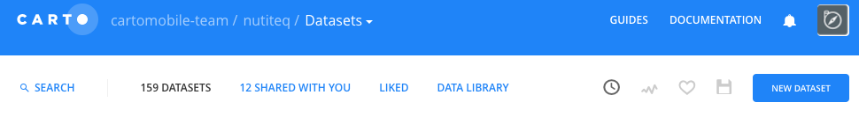
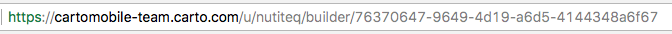
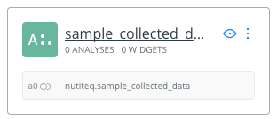

## DATA COLLECTION

Sample app demonstrating how **Carto Mobile SDK** and **CARTO Engine** can be used to actively (and passively) collect data. **CARTO MAPS API** is used to query an existing map built with **CARTO Builder**.

##### IMPORTANT!

`Conf.cs` is missing from the source code, this application will not compile out-of-the-box. `Conf.cs` is there all our account-specific configuration is located, e.g. Amazon S3 authentication, CARTO username, table name, function name etc.

`Conf_Template.cs` serves as a template for your own `Conf.cs` file. 

##### SETUP

* Create an account at [carto.com](https://carto.com/)
* Set up a new data set:

* Make the data set available via link (this and the following step are necessary because you shouldn't use CARTO API key in your mobile application)
* Create an SQL function, we recommend via [CDB Manager](https://github.com/CartoDB/cdb-manager) (our function is available [here](cdb_insert_collected_data))
* Create your map
* Grab the map's name from your url:  The GUID at the end of the url is your map's name. CartoMobileSDK retrieves maps by their name. However, the formatting is a bit different: add a `tpl_` prefix and replace dashes with underscores, so with our map, the final format would be: `tpl_76370647_9649_4d19_a6d5_4144348a6f67`

To modify how your data is displayed, click on the layer: 

Here you can change the color of your entries, how they are aggregated etc.

##### USAGE

Open the application, press the **+** icon to open location choice mode (crosshair for maximum precision), and click done when complete. A popup will slide in.

Now enter a **title**, **description** and, optionally, **take a photo** – now press the done button, your data will be uploaded to our CARTO table and, if taken, your photo will be uploaded to amazon S3 (the url is added to your CARTO table).

##### DISCLAIMER

This is a sample app with relatively simple code structure, it has not passed extensive testing etc. I can assure you, if you wish to break it, you will be able to.